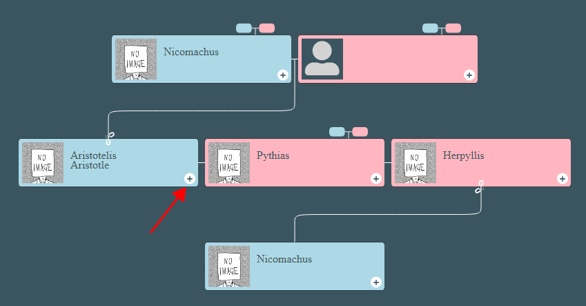
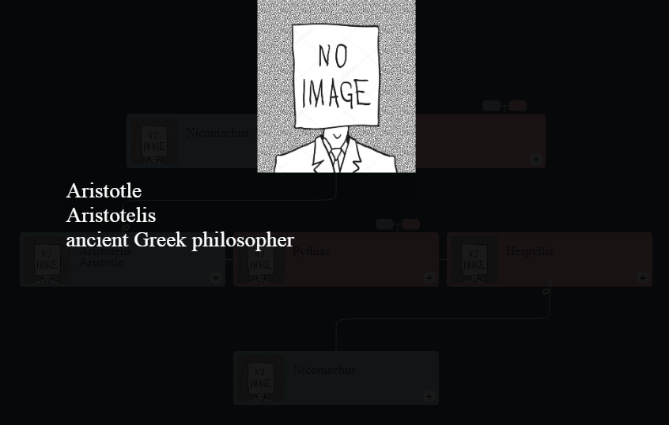

# family-chart-details-form

This example shows how to implement the details form for your family tree based on the [family-chart](https://github.com/donatso/family-chart).

Use the details form to add a biography for a person.

[Demo](https://trots.github.io/family-chart-details-form/).

## Get started

1. Clone this repository.
2. Run `index.html` in your browser to see the example.
3. Click to the "+" button to open the details form.

    
    
    

4. Click on the details form to close it.
